 

> Frontend & fullstack engineer shipping production tools across TypeScript, Python, and React.
> 76 public repos. Currently open to frontend and fullstack roles.

---

## ◈ Live Stats

<table>
<tr>
<td>

</td>
<td>

</td>
</tr>
</table>

---

## ◈ Recent Activity

<!--START_SECTION:activity-->
1. 💪 Opened PR [#6](https://github.com/janenyasoro/GreenFarm_Management_Backend/pull/6) in [janenyasoro/GreenFarm_Management_Backend](https://github.com/janenyasoro/GreenFarm_Management_Backend)
2. 💪 Opened PR [#5](https://github.com/janenyasoro/GreenFarm_Management_Backend/pull/5) in [janenyasoro/GreenFarm_Management_Backend](https://github.com/janenyasoro/GreenFarm_Management_Backend)
3. 🎉 Merged PR [#1](https://github.com/iankinoti-cloud/Flask-SQLAlchemy-Workout-Application-Backend/pull/1) in [iankinoti-cloud/Flask-SQLAlchemy-Workout-Application-Backend](https://github.com/iankinoti-cloud/Flask-SQLAlchemy-Workout-Application-Backend)
4. 💪 Opened PR [#1](https://github.com/iankinoti-cloud/Flask-SQLAlchemy-Workout-Application-Backend/pull/1) in [iankinoti-cloud/Flask-SQLAlchemy-Workout-Application-Backend](https://github.com/iankinoti-cloud/Flask-SQLAlchemy-Workout-Application-Backend)
<!--END_SECTION:activity-->

---

## ◈ Project Spotlight

| Project | Stack | What it does |
|---------|-------|--------------|
| [**NEXUS**](https://github.com/iankinoti-cloud/nexus) | TypeScript · React | AI Operating System for creative enterprises — Moringa hackathon project |
| [**beyond-test-coverage**](https://github.com/iankinoti-cloud/beyond-test-coverage) | Python · Vitest | LLM test suite quality benchmark with 10-rule anti-fragility contract |
| [**AEGIS Auth**](https://github.com/iankinoti-cloud/authenticating-_-system) | Flask · React | Liquid-glass authentication system — live at aegis-auth-peach.vercel.app |
| [**Nidus**](https://github.com/iankinoti-cloud/nidus) | React · Supabase | Sprint management app with AI assistant and real-time collaboration |
| [**Django Blog API**](https://github.com/iankinoti-cloud/django-blog-api) | Python · Django | REST API with slides deck — built as a teaching artifact |

---

## ◈ Stack

---

Dashboard auto-updates daily via GitHub Actions · <a href="mailto:ian.kinoti@student.moringaschool.com">ian.kinoti@student.moringaschool.com</a>

